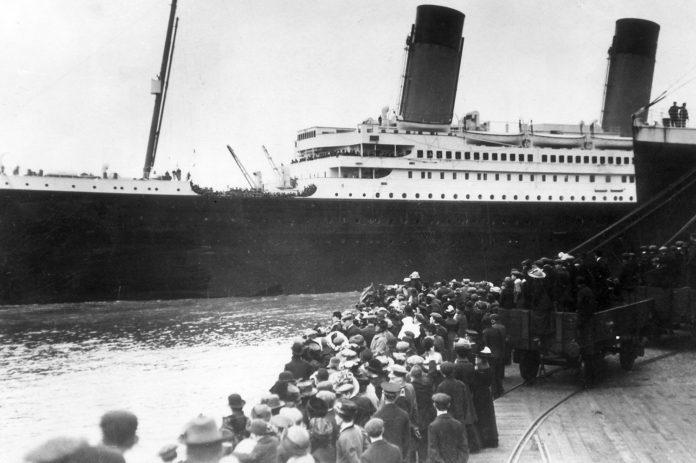
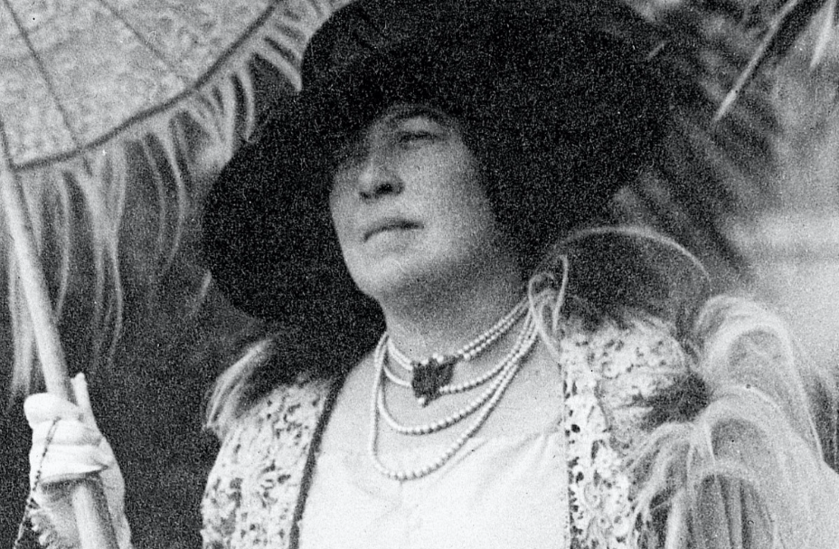

<style>
body {
text-align: justify
}
</style>

```{r setup, include=FALSE}
library(tufte)
library(ggplot2)
# invalidate cache when the tufte version changes
knitr::opts_chunk$set(cache.extra = packageVersion('tufte'))
options(htmltools.dir.version = FALSE)
```

# **Introduction**

The **RMS Titanic** story has living with us through numerous stories and films until now. Titanic was known as the one of the world's most celebrated ship because it was the biggest ship that has been made by human at that time. Through its popularity, many wealthy people, high-ranking officials and celebrities were on-board to witness the Titanic's **Maiden Voyage** along with other 2,222 passengers and crew. 

```{r fig-main, fig.cap = "Departure of Titanic on April 10, 1912", cache=TRUE}

```

On April 15, after 5 days of sailing, Titanic has sank in the North Atlantic after crashing an iceberg. Of the 2,222 passengers and crew on board. More than 1,500 lost their lives in the disaster. Because of this unfortunate event, there are so many studies and speculation about the lack of satisfactory emergency procedures when the disaster is happening. Such as the lifeboats shortage, the violation of unwritten law of the sea , first-class priority, and much more.

In this document, we will try to answer some speculation with the analysis about this unfortunate event that happened in 1912. 

# **Understanding our Data**

We will use "[Kaggle's Titanic Dataset](https://www.kaggle.com/competitions/titanic/data)" that's already famous for many similar prediction.

```{r}
titanic <- read.csv("datainput/train.csv",row.names = "PassengerId")
```
### _Initial Column Description_:
* `Survival`: Survival, **0** = _No_, **1** = _Yes_
* `Pclass`: Ticket class, **1** = _1st_, **2** = _2nd_, **3** = _3rd_
* `Sex`: Gender
* `Age`: Age in years
* `SibSp`: number of siblings / spouses aboard the Titanic
* `Parch`: number of parents / children aboard the Titanic
* `Ticket`: Ticket number
* `Fare`: Passenger Fare
* `Cabin`: Cabin number
* `Embarked`: Port of Embarkation, **C** = _Cherbourg_, **Q** = _Queenstown_, **S** = _Southampton_

# **Data Cleansing**

Before we go any further, we should see the condition of our data then cleaning the data to convert a raw dataset into a useable form to make it more relevant with our analysis later.

## Missing Values

First thing that we want to do is looking for missing values. It is important to handle missing data because any analytic results based on a dataset with missing values could be biased. ^[https://en.wikipedia.org/wiki/Missing_data]

### _Data Structure_:
```{r}
str(titanic)
```

```{r}
sort(colSums(is.na(titanic)),decreasing=T)
nrow(titanic)
```
The only column that has missing values is `Age` column. However, the proportion of the missing values is quite large: 177 rows of 891 rows which is about 19,9% of the data. And If we do further scrunity with our **Data Structure**, we can see in the `Cabin` column, there are values with "" means the _Passenger's Cabin was not specified/known during the collection of the data_. Thus we can treat the value as missing values and check its proportion within the column.
```{r}
sort(head(table(titanic$Cabin)), decreasing=T)
```
There are, too, large amount of missing values (687 rows of 891) in `Cabin` column which is 77% of the data. Since our goal is to avoid biased analytics, we need to drop these 2 columns because we will not use it for our analysis.
```{r}
titanic <- subset(titanic,select=-c(Age,Cabin))
```

## Inessential Columns

What made a column to be **Inessential**? In this project, we will determine it by looking at **which column that's already been represented with another column** and **which column that doesn't have any relation with the** `Survival` **column by just looking at it**. As of now, by our understanding, there are 6 columns with such characteristics: `Ticket`, `Embarked`, `Fare`, `Name`, `SibSp`, and `Parch`.

### _Reason of Removal_:
* `Ticket`: Too much unique values and it doesn't represent anything that related to `Survivability`.
* `Embarked`: It doesn't mean much since when the disaster happened, all passengers were already embarked from their respective docks.
* `Fare`: If we talk about how cheap/expensive each fare. It should be already represented with `Pclass` since the higher the `Fare`, the higher `Pclass` that you can get.
* `Name`: Same as `Fare`, we can represent each name `Title` with `Pclass` along with `Sex`.

Drop those columns from our dataset.
```{r}
titanic <- subset(titanic,select=-c(Ticket,Embarked,Fare,Name))
```

### `Relatives`

* `SibSp` and `Parch`: Since these two columns represent how much Passenger's Relatives that were also on-board, then there are chances that passenger was on-board without any relatives.

Before we drop those columns altogether, we want to simplify them into one new column called `Relatives`. This column will give you value of **No** if you're _alone_ and **Yes** if you're _with relatives_ no matter how much is it.

```{r}
titanic$FamilySize <- titanic$SibSp + titanic$Parch

convert_family = function(x){
  if(x == 0) {x <- "No"}
  else {x <- "Yes"}
}

titanic$Relatives <- sapply(X = titanic$FamilySize, 
                            FUN = convert_family)
```
Check the if the `Relatives` values are as we desired or not:
```{r}
head(titanic[,c("SibSp","Parch","FamilySize","Relatives")],8)
```
Drop `SibSp`, `Parch`, and `FamilySize` columns since their values already **represented** by our new `Relatives` column.
```{r}
titanic <- subset(titanic,select=-c(SibSp,Parch,FamilySize))
```

# **Final Dataset**

```{r}
knitr::kable(titanic[1:6,c("Sex","Relatives","Pclass","Survived")], 
             caption = 'Final Dataset.')
```
Check the final data type:
```{r}
str(titanic)
```
Change the final data type to the desired one:
```{r}
titanic$Pclass <- as.factor(titanic$Pclass)
titanic$Sex <- as.factor(titanic$Sex)
titanic$Relatives <- as.factor(titanic$Relatives)
```

# **Analysis**

The rest of this document will be consists of our analysis about Survivability Factor based on **three variables** left in our dataset.

## Pclass Factor

> "Did you know? Passengers traveling first class on Titanic were roughly 44 percent more likely to survive than other passengers."^[https://www.history.com/topics/early-20th-century-us/titanic]
>
> `r tufte::quote_footer('--- history.com')`

To answer that same question, we will try to calculate the **chance of survival** between each class.

```{r fig-margin, fig.margin = TRUE, fig.width=3.5, fig.height=3.5, cache=TRUE, message=FALSE}
# Calculate the chance
surv_mean_class <- aggregate(Survived~Pclass,titanic,mean)
surv_mean_class$Survived <- surv_mean_class$Survived * 100
colnames(surv_mean_class)[2] <- "Survival_Chance"
surv_mean_class$Pclass <- factor(surv_mean_class$Pclass,
                                 labels = c('1st Class', '2nd Class', '3rd Class'))
knitr::kable(surv_mean_class)

# Plot
ggplot(surv_mean_class, aes(Pclass, Survival_Chance))+
  geom_col(aes(fill=Pclass), fill = c("#C6563D","#292625","#959595"), col="Black")+
  theme(plot.background = element_rect(fill = "#EEEEEE", color = "#EEEEEE"),
        panel.background = element_rect(fill = "#EEEEEE"),
        panel.grid = element_line(colour = "#EEEEEE"))+
  labs(x=NULL,
       y="Survival Chance(%)")

```
The _1st Class_ were roughly **16%** and **39%** more likely to survive than the _2nd Class_ and _3rd Class_ respectively. But **What if we want to know the chance between the** _1st Class_ **and the** _2nd & 3rd_ **altogether?**

```{r}
# Change the 2nd & 3rd Class into 'Other Class'
titanic_other <- titanic

convert_class = function(x){
  if(x == "1") {x <- "1st Class"}
  else {x <- "Other Class"}
}

titanic_other$Pclass <- sapply(X = titanic_other$Pclass, 
                            FUN = convert_class)
titanic_other$Pclass <- as.factor(titanic_other$Pclass)
```

```{r fig-margin1, fig.margin = TRUE, fig.width=3.5, fig.height=3.5, cache=TRUE, message=FALSE}
# Calculate the chance
surv_mean_class_other <- aggregate(Survived~Pclass,titanic_other,mean)
surv_mean_class_other$Survived <- surv_mean_class_other$Survived * 100
colnames(surv_mean_class_other)[2] <- "Survival_Chance"
knitr::kable(surv_mean_class_other)

# Plot
ggplot(surv_mean_class_other, aes(Pclass, Survival_Chance))+
  geom_col(aes(fill=Pclass), fill = c("#C6563D","#292625"), col="Black")+
  theme(plot.background = element_rect(fill = "#EEEEEE", color = "#EEEEEE"),
        panel.background = element_rect(fill = "#EEEEEE"),
        panel.grid = element_line(colour = "#EEEEEE"))+
  labs(x=NULL,
       y="Survival Chance(%)")

```
When we grouped the other class altogether, the differences between the _1st Class_ and the _Other Class_ is about **32%**. The result, however, is different with the number that has been stated by  [history.com](https://www.history.com/topics/early-20th-century-us/titanic). The reason of this might be because the dataset from Kaggle is not complete enough which only 891 Passengers recorded out of 2222 Passengers.^[https://titanicfacts.net/titanic-passengers/]

However, we can clearly see the same pattern within these two results, that, **the** _1st Class_ **has always likely to have better survival chance rather than the other classes**.

## Sex Factor

The origin of the phrase _"Women and Children First"_ was started when HMS Birkenhead sank off the coast of South Africa on 26th February 1852.^[https://www.phrases.org.uk/meanings/women-and-children-first.html] Saving women and children first was tied so closely to the disaster that the practice became known as the **Birkenhead Drill**. ^[https://www.historic-uk.com/CultureUK/Women-Children-First/] 
```{r fig-main1, fig.cap = "Margaret Brown, better known as ‘the unsinkable Molly Brown’, earned her nickname because she survived the sinking of the Titanic and later went on to become a staunch philanthropist and activist.", cache=TRUE}

```
In this section, we am going to calculate the chance of survival based on Passenger's `Gender` to see if the **drill** has been maintained when the disaster is happening.

```{r fig-margin2, fig.margin = TRUE, fig.width=3.5, fig.height=3.5, cache=TRUE, message=FALSE}
# Calculate the chance
surv_mean_sex <- aggregate(Survived~Sex,titanic,mean)
surv_mean_sex$Survived <- surv_mean_sex$Survived * 100
colnames(surv_mean_sex)[2] <- "Survival_Chance"

knitr::kable(surv_mean_sex)

# Plot
ggplot(surv_mean_sex, aes(Sex, Survival_Chance))+
  geom_col(aes(fill=Sex), fill = c("#C6563D","#292625"), col="Black")+
  theme(plot.background = element_rect(fill = "#EEEEEE", color = "#EEEEEE"),
        panel.background = element_rect(fill = "#EEEEEE"),
        panel.grid = element_line(colour = "#EEEEEE"))+
  labs(x=NULL,
       y="Survival Chance(%)")

```
Women has **55%** more chance to survive rather than its counterpart so we can assume that the drill has been maintained. However, Titanic had total of **20** Lifeboats, in which each Lifeboat can held total of 68 people and we can conclude that the Lifeboats could take about 1360 passengers or more.^[https://en.wikipedia.org/wiki/Lifeboats_of_the_Titanic] 

Then we want to see how much women were on-board based on the dataset.
```{r}
#Calculate the frequency
sex_freq <- as.data.frame(table(titanic$Sex))
colnames(sex_freq)[1] <- "Sex"
knitr::kable(sex_freq)
```
There were only 314 Female Passengers and if we look for the actual number, there were 402 Women Passengers on-board^[https://titanicfacts.net/titanic-passengers], which were still under the capacity of all lifeboats. Meaning that all women were supposedly can be saved but unfortunately, they're not.

By this, though the **Birkenhead Drill** was upheld as a “chivalric ideal” among ship-crews, in fact, 60 years after the sinking of the troopship (which was the time when RMS Titanic disaster happened), **this "ideal" was not completely adhered by the crews on-board**.

## Family Factor

> "Hundreds of human dramas unfolded between the order to load the lifeboats and the ship’s final plunge: Men saw off wives and children, families were separated in the confusion and selfless individuals gave up their spots to remain with loved ones or allow a more vulnerable passenger to escape."
>
> `r tufte::quote_footer('--- history.com')`

```{r fig-main2, fig.cap = "The Sad Parting, illustration of 1912.", fig.align='center',cache=TRUE}
knitr::include_graphics("assets/sadparting.png")
```
This is the last factor that we want to analyze in this document. As we know before, there were many children and women on-board along with their Husband/Dad and there were, too, people on-board without any relatives with them. Now we want see how much proportion of those who were alone and those who're with families.

```{r}
#Calculate the proportion
fam_prop <- as.data.frame(prop.table(table(titanic$Relatives)))
colnames(fam_prop)[1] <- "Relatives"
colnames(fam_prop)[2] <- "Proportion%"
fam_prop$`Proportion%` <- fam_prop$`Proportion%`*100
knitr::kable(fam_prop)
```
There were roughly **60%** people that on-board without any relatives and **40%** with their relatives. And we are going to check their Survival Chance based on our dataset.
```{r fig-margin3, fig.margin = TRUE, fig.width=3.5, fig.height=3.5, cache=TRUE, message=FALSE}
# Calculate the chance
surv_mean_fam <- aggregate(Survived~Relatives,titanic,mean)
surv_mean_fam$Survived <- surv_mean_fam$Survived * 100
colnames(surv_mean_fam)[2] <- "Survival_Chance"

knitr::kable(surv_mean_fam)

# Plot
ggplot(surv_mean_fam, aes(Relatives, Survival_Chance))+
  geom_col(aes(fill=Relatives), fill = c("#C6563D","#292625"), col="Black")+
  theme(plot.background = element_rect(fill = "#EEEEEE", color = "#EEEEEE"),
        panel.background = element_rect(fill = "#EEEEEE"),
        panel.grid = element_line(colour = "#EEEEEE"))+
  labs(x="Relatives",
       y="Survival Chance(%)")

```
Passengers with relatives has a better chance of survival (**20%** more) rather than people that were alone. This might be because the number of children and wives prioritized by each families. Moreover, if we see the "quote" from above, there were _"selfless individuals gave up their spots to remain with loved ones or allow a more vulnerable passenger to escape"_ and this can be the reason that why not all Women were saved in the first place.

# **Conclusion**

Now we know that there are *3 factors* that affect Passenger's Survivability:

* `Pclass` factor    : Passengers from the _1st Class_ are more likely to survive in the event.
This answers the speculation that _1st Class_ passengers were highly prioritized.

* `Sex` factor       : _Female_ passenger are more likely to survive in the event.
This answers the speculation that _Female_ passengers were highly prioritized.

* `Relatives` factor : Passenger that with _Relatives_ on-board are more likely to survive in the event.
This answers the speculation that _Couples/Families_ were highly prioritized.

However, there are still much speculation that we can't answers with our analysis about the lack of satisfactory emergency procedures and we hope the same speculation will find some certitude in the future.


